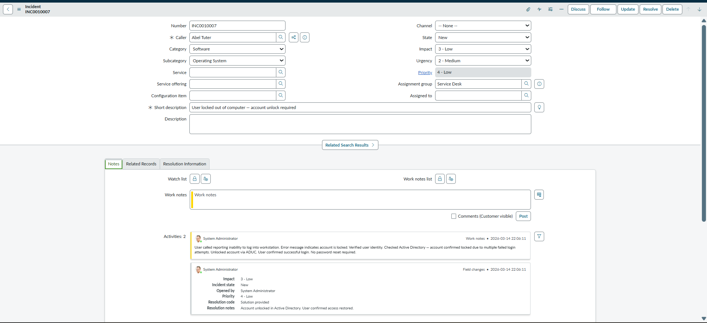
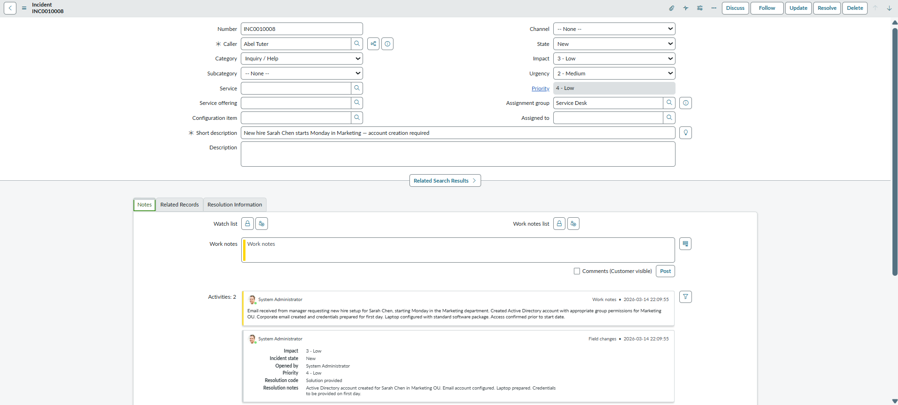
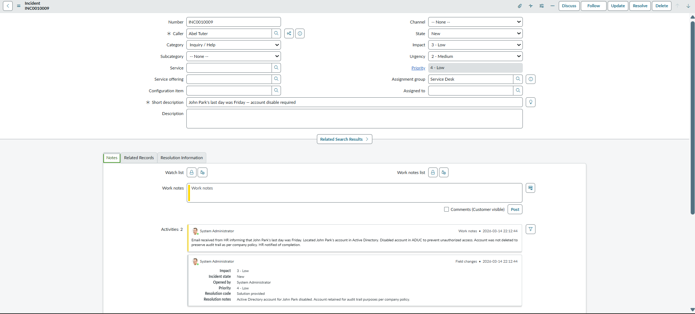

# Active Directory — Ticket Scenarios

This document covers real-world Service Desk ticket scenarios involving Active Directory tasks. Each ticket was created in ServiceNow and resolved using Active Directory Users and Computers (ADUC), simulating the complete L1 workflow.

---

## Scenario 1 — Account Unlock

| Field | Value |
|---|---|
| **Ticket** | INC0010007 |
| **Caller** | Abel Tuter |
| **Category** | Software |
| **Subcategory** | Operating System |
| **Impact** | 3 - Low |
| **Urgency** | 2 - Medium |
| **Priority** | P3 - Moderate |
| **Assignment Group** | Service Desk |
| **State** | Resolved |

**Short Description:** User locked out of computer — account unlock required

**Work Notes:**
> User called reporting inability to log into workstation. Error message indicates account is locked. Verified user identity. Checked Active Directory — account confirmed locked due to multiple failed login attempts. Unlocked account via ADUC. User confirmed successful login. No password reset required.

**Resolution Notes:**
> Account unlocked in Active Directory. User confirmed access restored.

---

## Scenario 2 — New Hire Account Creation

| Field | Value |
|---|---|
| **Category** | Inquiry / Help |
| **Impact** | 3 - Low |
| **Urgency** | 2 - Medium |
| **Priority** | P3 - Moderate |
| **Assignment Group** | Service Desk |
| **State** | Resolved |

**Short Description:** New hire Sarah Chen starts Monday in Marketing — account creation required

**Work Notes:**
> Email received from manager requesting new hire setup for Sarah Chen, starting Monday in the Marketing department. Created Active Directory account with appropriate group permissions for Marketing OU. Corporate email created and credentials prepared for first day. Laptop configured with standard software package. Access confirmed prior to start date.

**Resolution Notes:**
> Active Directory account created for Sarah Chen in Marketing OU. Email account configured. Laptop prepared. Credentials to be provided on first day.

---

## Scenario 3 — Account Disable (Offboarding)

| Field | Value |
|---|---|
| **Category** | Inquiry / Help |
| **Impact** | 3 - Low |
| **Urgency** | 2 - Medium |
| **Priority** | P3 - Moderate |
| **Assignment Group** | Service Desk |
| **State** | Resolved |

**Short Description:** John Park's last day was Friday — account disable required

**Work Notes:**
> Email received from HR informing that John Park's last day was Friday. Located John Park's account in Active Directory. Disabled account in ADUC to prevent unauthorized access. Account was not deleted to preserve audit trail as per company policy. HR notified of completion.

**Resolution Notes:**
> Active Directory account for John Park disabled. Account retained for audit trail purposes per company policy.

---

## Key Takeaways

- Account unlocks and password resets are the most common L1 Active Directory tasks
- New hire onboarding requires coordination between HR, IT and the manager
- When offboarding, accounts should always be **disabled, not deleted** — this preserves the audit trail
- Every Active Directory action should be documented in a ServiceNow ticket for accountability and tracking
