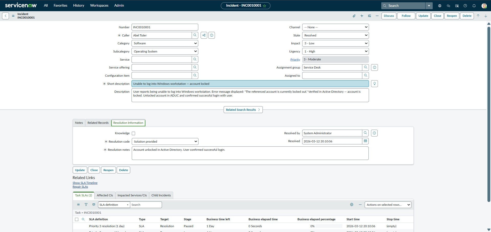
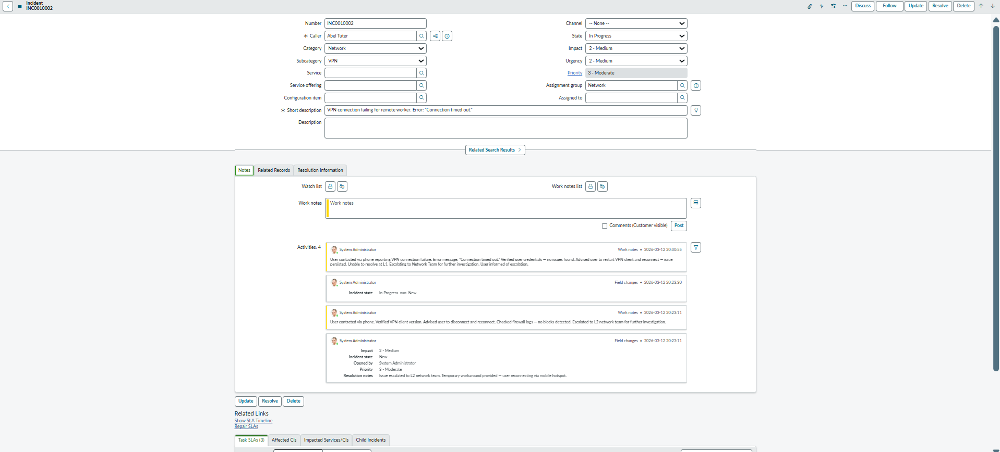
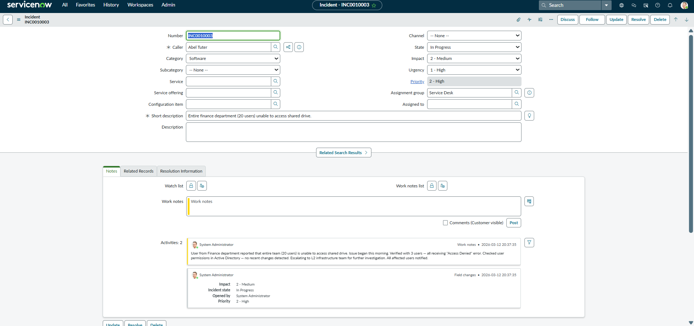
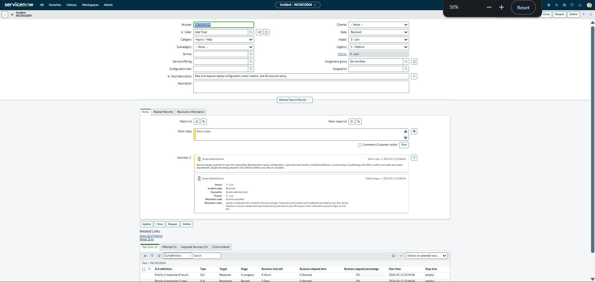
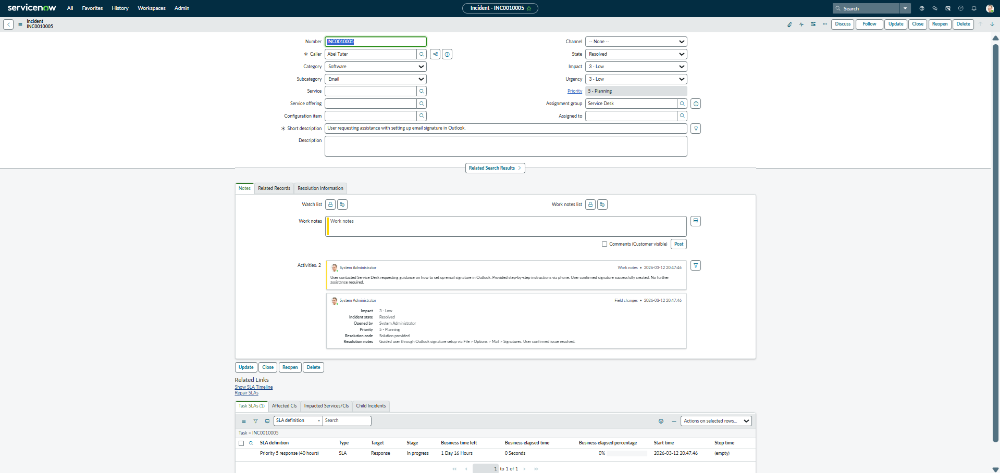

# IT-Support-Operations-Lab

Hands-on IT Service Desk lab covering ticketing systems (ServiceNow & Jira), Active Directory, network diagnostics, and Windows/macOS troubleshooting — with practical exercises and real-world ticket simulations aligned with ITIL fundamentals.

---

## 📋 Topics Covered

This lab documents hands-on practice across the core tools and workflows used in IT Service Desk environments:

- **Ticketing Systems** — Creating, triaging, prioritizing, and resolving incidents in ServiceNow, following ITIL-based ticket lifecycle
- **Active Directory** — User account management, password resets, account unlocks, group membership, and access control
- **Network Diagnostics** — Command-line tools including `ipconfig`, `ping`, `tracert`, `nslookup`, and `netstat` for connectivity troubleshooting
- **Windows & macOS Troubleshooting** — Using Task Manager, Event Viewer, Disk Cleanup, Credential Manager, and macOS equivalents
- **Remote Support** — Remote Desktop Protocol (RDP), Quick Assist, and TeamViewer workflows
- **ITIL Fundamentals** — Incident vs Problem vs Change vs Service Request, SLA awareness, and ticket prioritization using the Impact × Urgency matrix
- **Communication & Escalation** — Handling user issues professionally, knowing when and how to escalate

---

## 🎫 Ticketing Systems — ServiceNow

### Overview
ServiceNow is an enterprise ITSM platform used by large organizations to manage IT incidents, service requests, and changes. This section documents hands-on practice using a Personal Developer Instance (PDI) running the Zurich release.

### Ticket Lifecycle
Every ticket follows this structured workflow:

1. **Creation** — Issue reported and logged
2. **Classification** — Incident vs Service Request
3. **Prioritization** — Impact × Urgency matrix
4. **Assignment** — L1 handles or escalates to L2/L3
5. **Investigation** — Troubleshooting steps documented
6. **Resolution** — Solution applied and documented
7. **Closure** — User confirms, ticket closed

### Priority Matrix

| | High Urgency | Medium Urgency | Low Urgency |
|---|---|---|---|
| **High Impact** | P1 — Critical | P2 — High | P3 — Medium |
| **Medium Impact** | P2 — High | P3 — Medium | P4 — Low |
| **Low Impact** | P3 — Medium | P4 — Low | P4 — Low |

---

### 📸 Incident Queue Overview

---

### 🎫 INC0010001 — Account Locked

| Field | Value |
|---|---|
| **Caller** | Abel Tuter |
| **Category** | Software |
| **Subcategory** | Operating System |
| **Impact** | 3 - Low |
| **Urgency** | 1 - High |
| **Priority** | P3 - Moderate |
| **Assignment Group** | Service Desk |
| **State** | Resolved |

**Short Description:** Unable to log into Windows workstation — account locked

**Work Notes:**
> Checked Active Directory. Account was locked due to multiple failed login attempts. Unlocked account via ADUC. User tested login — successful. No password reset required.

**Resolution:** Account unlocked in Active Directory. User confirmed successful login.

---

### 🎫 INC0010002 — VPN Connection Failing

| Field | Value |
|---|---|
| **Caller** | Abel Tuter |
| **Category** | Network |
| **Impact** | 2 - Medium |
| **Urgency** | 2 - Medium |
| **Priority** | P3 - Moderate |
| **Assignment Group** | Network Team |
| **State** | In Progress |

**Short Description:** VPN connection failing for remote worker. Error: "Connection timed out."

**Work Notes:**
> User contacted via phone reporting VPN connection failure. Error message: "Connection timed out." Verified user credentials — no issues found. Advised user to restart VPN client and reconnect — issue persisted. Unable to resolve at L1. Escalating to Network Team for further investigation. User informed of escalation.

**Resolution:** Escalated to L2 Network Team. Ticket remains open pending investigation.

---

### 🎫 INC0010003 — Finance Department Cannot Access Shared Drive

| Field | Value |
|---|---|
| **Caller** | Abel Tuter |
| **Category** | Software |
| **Impact** | 2 - Medium |
| **Urgency** | 1 - High |
| **Priority** | P2 - High |
| **Assignment Group** | Service Desk |
| **State** | In Progress |

**Short Description:** Entire finance department (20 users) unable to access shared drive.

**Work Notes:**
> User from Finance department reported that entire team (20 users) is unable to access shared drive. Issue began this morning. Verified with 3 users — all receiving "Access Denied" error. Checked user permissions in Active Directory — no recent changes detected. Escalating to L2 infrastructure team for further investigation. All affected users notified.

**Resolution:** Issue identified as incorrect shared drive permissions following recent server maintenance. L2 infrastructure team restored access permissions for Finance department group in Active Directory. All 20 users confirmed access restored.

---

### 🎫 INC0010004 — New Hire Setup

| Field | Value |
|---|---|
| **Caller** | Abel Tuter |
| **Category** | Inquiry / Help |
| **Impact** | 3 - Low |
| **Urgency** | 2 - Medium |
| **Priority** | P3 - Moderate |
| **Assignment Group** | Service Desk |
| **State** | Resolved |

**Short Description:** New hire requires laptop configuration, email creation, and AD account setup.

**Work Notes:**
> Service request received for new hire onboarding. Requirements: laptop configuration, corporate email creation, and Active Directory account setup. Coordinating with HR to confirm start date and access requirements. Equipment being prepared. User will be notified once setup is complete.

**Resolution:** Laptop configured with standard software package. Corporate email created and credentials provided to new hire. Active Directory account created with appropriate group permissions per HR request. User confirmed successful login on first day.

---

### 🎫 INC0010005 — Outlook Signature Setup

| Field | Value |
|---|---|
| **Caller** | Abel Tuter |
| **Category** | Software |
| **Impact** | 3 - Low |
| **Urgency** | 3 - Low |
| **Priority** | P4 - Low |
| **Assignment Group** | Service Desk |
| **State** | Resolved |

**Short Description:** User requesting assistance with setting up email signature in Outlook.

**Work Notes:**
> User contacted Service Desk requesting guidance on how to set up email signature in Outlook. Provided step-by-step instructions via phone. User confirmed signature successfully created. No further assistance required.

**Resolution:** Guided user through Outlook signature setup via File > Options > Mail > Signatures. User confirmed issue resolved.

---

### 📊 Incident Management Dashboard

